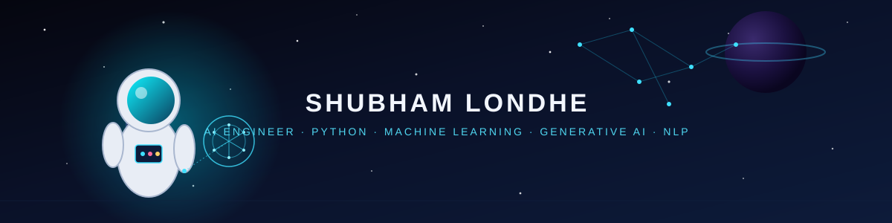

<div align="center">



# 👨‍💻 SHUBHAM LONDHE

**AI ENGINEER · PYTHON · MACHINE LEARNING · GENERATIVE AI · NLP**

Building intelligent systems with Python, Machine Learning, Generative AI and NLP —
turning real-world problems into practical, working AI.

[](https://github.com/shubhammlondhe2005)
[](https://linkedin.com/in/shubham-londhe555)
[](mailto:Shubhammlondhe@gmail.com)

</div>

<br>

<details open>
<summary><h2>🧬 01 · WHO I AM</h2></summary>

<table>
<tr>
<td width="60%" valign="top">

### BUILDER BY NATURE. ENGINEER BY DIRECTION.

I'm a B.Tech Computer Science student specializing in **Artificial Intelligence & Machine Learning** at **JSPM University, Pune**. My focus sits at the intersection of Machine Learning, Generative AI, NLP, and Agentic AI — with Python as the thread that ties it all together.

What draws me to this field is the process of turning a messy, real problem into a working intelligent system:

```
PROBLEM → DATA → MODEL → INTELLIGENT SYSTEM
```

I care more about building things that actually work than collecting theory I never apply. My current projects reflect that — an AI-driven supply chain platform, a multi-agent cyber defense framework, and a multi-agent healthcare research system — each one an attempt to push AI concepts into practical engineering.

**My philosophy:**

> Learn deeply. Build practically. Engineer intelligently. Improve continuously.

</td>
<td width="40%" valign="top">

### ⚡ QUICK PROFILE

| | |
|---|---|
| 🎓 **Education** | B.Tech CSE — AI & ML |
| 🏫 **University** | JSPM University, Pune |
| 📊 **CGPA** | `7.47 / 10.00` |
| 📚 **Status** | Semester VI completed |
| 🧠 **Core Focus** | ML · NLP · GenAI · Agentic AI |
| 🐍 **Primary Language** | Python |
| 🎯 **Goal** | AI Engineer |
| 🚀 **Building** | Practical intelligent systems |
| 📍 **Location** | Pune, Maharashtra, India |

</td>
</tr>
</table>

</details>

<br>

<details>
<summary><h2>🧰 02 · TECH STACK — CLICK TO EXPLORE</h2></summary>

<br>

<details open>
<summary><b>🧠 Core Strengths</b></summary>
<br>


Python, NumPy, Pandas, Matplotlib, GitHub, DBMS, Operating Systems, and Computer Networks are where I'm most confident — the foundation everything else is built on.

</details>

<details>
<summary><b>🤖 AI / Machine Learning</b> — building</summary>
<br>


Machine Learning · Deep Learning · Computer Vision · Model Evaluation · Data Preprocessing · Feature Engineering · Predictive Analytics

</details>

<details>
<summary><b>🗣️ NLP / Generative AI</b> — building</summary>
<br>

NLP · Text Classification · Naive Bayes · CountVectorizer · Generative AI · LLM concepts · Agentic AI · AI workflow automation

</details>

<details>
<summary><b>📊 Data</b></summary>
<br>


SQL · Data Analytics · Data Preprocessing · Data Visualization · EDA

</details>

<details>
<summary><b>🛠️ Engineering Fundamentals</b></summary>
<br>

DSA · DBMS · Operating Systems · Computer Networks · Git · GitHub

</details>

<details>
<summary><b>💻 Development — developing / expanding</b></summary>
<br>


Flask · FastAPI · HTML · CSS · JavaScript — early-stage but actively expanding for backend and interface work.

</details>

<details>
<summary><b>☁️ Cloud & Deployment</b> — developing / expanding</summary>
<br>


Docker · AWS · Google Cloud — foundational exposure through certifications, growing hands-on depth.

</details>

</details>

<br>

## 🏭 03 · CURRENT FLAGSHIP — INTELLIGENT SUPPLY CHAIN

### Intelligent Warehouse & Supply Chain Optimization for Perishable Goods

`🟢 FINAL YEAR PROJECT · ONGOING`

**Problem.** Perishable-goods supply chains lose value every day to poor demand forecasting, spoilage, and inefficient replenishment.

**Approach.** Build an AI-powered, end-to-end platform that layers forecasting, shelf-life intelligence, and optimization on top of the supply chain, so decisions are made ahead of the problem instead of after it.

**Workflow**

```
SUPPLY-CHAIN DATA
      ↓
DATA PREPROCESSING → FEATURE ENGINEERING
      ↓
DEMAND FORECASTING
      ↓
SHELF-LIFE / SPOILAGE ANALYSIS
      ↓
INVENTORY OPTIMIZATION → WAREHOUSE MANAGEMENT
      ↓
SUPPLIER + LOGISTICS ANALYSIS
      ↓
REPLENISHMENT / PRICING RECOMMENDATIONS
      ↓
AI DECISION SUPPORT
      ↓
DASHBOARD + AI AGENT
```

**Planned / In Development capabilities**

- Demand forecasting
- Inventory management
- Shelf-life prediction
- Expiry / spoilage prediction
- Stock replenishment
- Dynamic pricing
- Warehouse management
- Supplier management
- Transportation / logistics optimization
- AI recommendation system
- Supply-chain dashboard
- AI chatbot / agent

**Tech direction:** Python · Machine Learning · Data Analytics · Predictive Analytics · Recommendation Systems — *technology stack evolving during development.*

**Expected impact:** reduced spoilage, tighter inventory turns, and faster, data-backed decisions across the perishable-goods supply chain.

<br>

## 🛡️ 04 · ADVANCED AI PROJECT — ARGUS AI

### ARGUS AI — Defense Core

**An Explainable Multi-Agent AI Cyber Defense Framework**

`🟢 ONGOING`

**Problem.** Modern network threats move faster than manual triage, and most detection systems offer little explanation for their decisions.

**Approach.** A multi-agent system where specialized agents handle detection, malware analysis, and network behavior — coordinated by an orchestrator and paired with an explainability layer, so every decision comes with a reason.

**Architecture**

```
                     ┌───────────────────────┐
                     │    ARGUS ORCHESTRATOR │
                     └───────────┬───────────┘
                                 │
            ┌────────────────────┼────────────────────┐
            ▼                    ▼                    ▼
      ┌───────────┐        ┌────────────┐       ┌────────────┐
      │ SENTINEL  │        │  MALWARE   │       │  NETWORK   │
      │   AGENT   │        │   HUNTER   │       │   AGENT    │
      └─────┬─────┘        └─────┬──────┘       └─────┬──────┘
            └────────────────────┼────────────────────┘
                                 ▼
                     ┌───────────────────────┐
                     │ EXPLAINABILITY ENGINE │
                     └───────────┬───────────┘
                                 ▼
                     ┌───────────────────────┐
                     │ DEFENSIVE PLANNER /   │
                     │         LLM           │
                     └───────────┬───────────┘
                                 ▼
                     ┌───────────────────────┐
                     │ RESPONSE & RECOVERY   │
                     └───────────────────────┘
```

**Flow**

```
DETECT → ANALYZE → CORRELATE → EXPLAIN → PREDICT → PLAN → RESPOND → RECOVER
```

**Scope** *(status: implementation still in progress — treat all items below as part of the ongoing build, not confirmed-complete)*

| Layer | Components |
|---|---|
| AI | ML · DL · NLP · LLMs · Agentic AI · Explainability (SHAP) |
| Backend | Python · FastAPI |
| Knowledge | Neo4j · Knowledge Graph |
| Frontend | React · Security Dashboard |
| Deployment | Docker · AWS · Google Cloud |
| Security Intelligence | MITRE ATT&CK |
| Research Datasets | CICIDS2017 · NSL-KDD · UNSW-NB15 |
| Advanced Concepts | GNN · Attack-path prediction · Adaptive trust score · RAG |

**Expected impact:** faster, explainable threat detection with a defensible reasoning trail instead of a black-box alert.

<br>

## 🏥 05 · RESEARCH PROJECT — MULTI-AGENT HEALTHCARE SYSTEM

`🔵 RESEARCH PROJECT · ONGOING`

**Problem.** Doctors lose time to manual chart review, scattered patient history, and repetitive documentation work.

**Approach.** A multi-agent AI architecture where specialized agents handle history summarization, report summarization, and workflow support — assisting doctors rather than replacing clinical judgment.

**Architecture**

```
                 USER / DOCTOR
                       │
                       ▼
              ┌─────────────────┐
              │ AI ORCHESTRATOR │
              └────────┬────────┘
                       │
        ┌──────────────┼──────────────┐
        ▼              ▼              ▼
   HISTORY AGENT   SUMMARY AGENT   WORKFLOW AGENT
        │              │              │
        └──────────────┼──────────────┘
                       ▼
                 KNOWLEDGE / RAG
                       │
                       ▼
                 AI DECISION LAYER
                       │
                       ▼
              DOCTOR AI SUMMARY
                       │
                       ▼
                WORKFLOW SUPPORT
```

**Research direction**

- Multi-agent AI architecture with specialized, communicating agents
- Doctor / medical assistant agent
- Patient history & medical report summarization
- Patient information extraction
- Healthcare workflow automation
- LLM + RAG over a medical knowledge base
- AI chatbot and web dashboard (FastAPI/Flask backend, React frontend)
- Explainable AI for decision support
- Docker-based deployment

> This is an early-stage research project. It does not involve clinical deployment, medical approval, or diagnostic claims of any kind.

<br>

## 🎓 06 · EDUCATION & ACADEMICS

**B.Tech — Computer Science, Artificial Intelligence & Machine Learning**
JSPM University, Pune · `2023 – 2027`

| Metric | Value |
|---|---|
| CGPA (through Sem VI) | **7.47 / 10.00** |
| Semester VI SGPA | **8.57** |

<details>
<summary>📊 Semester-wise performance</summary>
<br>

| Semester | Score |
|---|---|
| Semester I | 7.03 |
| Semester II | 6.99 |
| Semester III | 7.26 |
| Semester IV | 7.21 |
| Semester V | 7.29 |
| Semester VI (CGPA) | 7.47 |
| Semester VI (SGPA) | **8.57** |

</details>

**School Education**

| Level | Board | Score | Year |
|---|---|---|---|
| Class XII (Science) | MSBSHSE | 78% | 2022 |
| Class X | CBSE | 70.2% | 2020 |

**Relevant coursework:** Artificial Intelligence · Machine Learning · Deep Learning · Natural Language Processing · Data Structures & Algorithms · Data Mining · Pattern Recognition & Anomaly Detection · DBMS · Computer Networks · Operating Systems · Generative AI · Data Analytics

<br>

## 🏅 07 · CERTIFICATIONS & CREDENTIALS

- Oracle Cloud Infrastructure 2025 Certified AI Foundations Associate
- Oracle Fusion AI Agent Studio Certified Foundations Associate
- NASA — Fundamentals of Remote Sensing
- Human Computer Interaction — Elite 90% — NPTEL
- Machine Learning & Data Science Virtual Internship — AICTE × EduSkills
- AI-ML Virtual Internship — AICTE × EduSkills
- AWS Academy Machine Learning Foundations
- AWS Academy Cloud Foundations
- Generative AI Foundations — upGrad × Microsoft

<br>

## 🏆 08 · ACHIEVEMENTS & LEADERSHIP

- Smart India Hackathon (SIH) — Participant
- EntrepreNex 2026 Startup Fest — Participant
- NPTEL Human Computer Interaction — Elite 90%
- AICTE AI-ML Virtual Internship
- AICTE Machine Learning & Data Science Virtual Internship
- Oracle AI Foundations & AI Agent Studio certifications
- Volunteering in college technical and cultural events

<br>

## 🗺️ 09 · CURRENTLY LEARNING

**Strengthening:** Machine Learning · Deep Learning · NLP · Generative AI · Agentic AI · DSA · SQL

**Expanding:** FastAPI · Flask · Docker · AWS · Google Cloud · Deployment · AI Engineering practices

<br>

## 🧭 10 · AI ENGINEER ROADMAP

```
                  CURRENT
                     │
        ┌────────────┼────────────┐
        ▼            ▼            ▼
      PYTHON       AI / ML       CS FUNDAMENTALS
        │            │            │
        └────────────┼────────────┘
                     ▼
                DEEP LEARNING
                     ▼
                     NLP
                     ▼
              GENERATIVE AI
                     ▼
                AGENTIC AI
                     ▼
              AI ENGINEERING
                     ▼
                API / BACKEND
                     ▼
              DOCKER / CLOUD
                     ▼
                  MLOps
```

```
PROBLEM → DATA → MODEL → LLM / AGENT → APPLICATION → API → DEPLOYMENT → MONITORING → IMPROVEMENT
```

<br>

## 🧠 11 · ENGINEERING PRINCIPLES

> Don't just train a model. Understand the problem, prepare the data, build the system, evaluate the result, and continuously improve it.

```
PROBLEM → UNDERSTAND → DATA → MODEL → EVALUATE → BUILD → DEPLOY → MONITOR → IMPROVE
```

<br>

## 📈 12 · GITHUB ACTIVITY

<div align="center">


</div>

<br>

### 🚀 Featured Repositories

| Project | Repository |
|---|---|
| 🏭 Intelligent Supply Chain | `REPLACE_WITH_REPOSITORY_URL` |
| 🛡️ ARGUS AI | `REPLACE_WITH_REPOSITORY_URL` |
| 🏥 Multi-Agent Healthcare | `REPLACE_WITH_REPOSITORY_URL` |
| 📧 Spam Email Classifier | `REPLACE_WITH_REPOSITORY_URL` |

<br>

## 🌌 13 · BEYOND CODE

Outside of AI and code, I spend time on **vlogging & content creation** and following **entrepreneurship & startups**. Both feed into the same instinct that drives my engineering work — taking a raw idea, shaping it, and putting it in front of people to see if it actually holds up. Content creation sharpens how I communicate technical ideas; watching startups sharpens how I think about what's actually worth building.

<br>

## 📬 14 · CONNECT WITH ME

<div align="center">

[](https://github.com/shubhammlondhe2005)
[](https://linkedin.com/in/shubham-londhe555)
[](mailto:Shubhammlondhe@gmail.com)

<br>

**BUILDING INTELLIGENT SYSTEMS.**
**LEARNING WITHOUT LIMITS.**
**ENGINEERING TOWARD THE FUTURE.**

`AI · ML · GENAI · NLP · ENGINEERING`

</div>
