<div align="center">



<br>

```
>>> whoami
shubham_londhe.py — AI & Machine Learning Engineer
>>> status
[ONLINE] compiling ideas into intelligent systems...
```

<br>

[](https://github.com/shubhammlondhe2005)
[](https://linkedin.com/in/shubham-londhe555)
[](https://shubham-londhe.vercel.app/)
[](mailto:Shubhammlondhe@gmail.com)
[](#)

<br>


</div>

<br>

---

### `>> summary.print()`

B.Tech CSE (AI & ML) student with hands-on experience across Python, Machine Learning, NLP, Data Analytics, Generative AI and Agentic AI. I build AI-driven solutions through academic projects, hackathons and AICTE/EduSkills virtual internships, and I'm currently developing an AI-powered supply chain optimization system for perishable goods. Oracle AI Certified and NPTEL Elite + Gold (90%), with additional training across AWS, NASA ARSET, TCS iON and upGrad × Microsoft. Interested in building practical, scalable and data-driven intelligent systems.

<br>

---

### `>> model.summary()`

```python
class ShubhamLondhe:
    def __init__(self):

        # 👤 Identity
        self.role = "AI & Machine Learning Engineer"
        self.location = "Pune, Maharashtra, India"
        self.education = "B.Tech CSE (AI & ML) | JSPM University | 2023-2027"

        # 💻 Programming
        self.languages = [
            "Python",
            "SQL"
        ]

        # 🤖 Machine Learning
        self.machine_learning = [
            "Scikit-learn",
            "Regression",
            "Classification",
            "Feature Engineering",
            "Model Evaluation",
            "Predictive Analytics"
        ]

        # 🧠 NLP
        self.nlp = [
            "Natural Language Processing",
            "Naive Bayes",
            "CountVectorizer",
            "Text Classification"
        ]

        # 📊 Data & Analytics
        self.data = [
            "Pandas",
            "NumPy",
            "Matplotlib",
            "Exploratory Data Analysis"
        ]

        # ✨ Generative & Agentic AI
        self.ai = [
            "Generative AI",
            "Agentic AI",
            "Prompt Engineering"
        ]

        # 🛠️ Tools & Environment
        self.tools = [
            "Git",
            "GitHub",
            "VS Code",
            "Jupyter",
            "Google Colab"
        ]

        # 🎓 Certifications
        self.certifications = [
            "Oracle AI Foundations",
            "Oracle AI Agent Studio",
            "NPTEL HCI — Elite + Gold (90%)"
        ]

        # 🚀 Current Project
        self.currently_building = (
            "AI-powered Supply Chain Optimization"
        )

        # 📚 Currently Learning
        self.currently_learning = [
            "Generative AI",
            "Agentic AI",
            "MLOps"
        ]

    def philosophy(self):
        return (
            "Don't just train a model — "
            "understand it, ship it, improve it."
        )
```

<br>

---

### `>> projects.list()`

<table>
<tr>
<td width="33%" valign="top">

**🏭 Intelligent Supply Chain**
`FINAL YEAR PROJECT · ONGOING`

AI-powered warehouse & supply chain optimization platform for perishable goods. ML models for demand forecasting, shelf-life prediction, and inventory optimization, plus a recommendation engine for stock replenishment and dynamic pricing.

`Python` `ML` `Forecasting` `Predictive Analytics`

</td>
<td width="33%" valign="top">

**🏥 Multi-Agent Healthcare System**
`RESEARCH PROJECT`

Multi-agent AI architecture for healthcare workflow management — agents proposed to summarize patient medical histories and assist doctors, with workflow automation strategies explored for clinical settings.

`Multi-Agent` `NLP` `Healthcare AI`

</td>
<td width="33%" valign="top">

**📧 Spam Email Classifier**
`COMPLETED`

NLP-based spam email classifier built with Naive Bayes and CountVectorizer, evaluated against labeled datasets.

`NLP` `Naive Bayes` `Classification`

</td>
</tr>
</table>

<br>

---

### `>> skills --verbose`

<div align="center">

**Languages**


**Machine Learning**


**NLP**


**Data & Analytics**


**Generative & Agentic AI**


**Tools**


**CS Fundamentals**


</div>

<br>

---

### `>> education.log()`

**B.Tech — Computer Science (Artificial Intelligence & Machine Learning)**
JSPM University, Pune · `2023 – 2027`

| Level | Institution | Board | Score | Year |
|---|---|---|---|---|
| B.Tech CSE (AI & ML) | JSPM University, Pune | — | Ongoing | 2023-2027 |
| Class XII (Science) | Kai. Shivrajji Deshmukh Jr. College | MSBSHSE | 78% | 2022 |
| Class X | Podar International School | CBSE | 70.2% | 2020 |

**Relevant coursework:** Artificial Intelligence · Machine Learning · Natural Language Processing · Data Structures & Algorithms · Database Management Systems · Computer Networks · Data Mining · Operating Systems

<br>

---

### `>> certifications.list()`

- 🎓 Oracle Cloud Infrastructure 2025 Certified AI Foundations Associate
- 🎓 Oracle Fusion AI Agent Studio Certified Foundations Associate
- 🎓 Human Computer Interaction — Elite + Gold (90%) — NPTEL
- 🎓 Machine Learning & Data Science Virtual Internship — AICTE × EduSkills
- 🎓 AI-ML Virtual Internship — AICTE × EduSkills
- 🎓 AWS Academy Machine Learning Foundations
- 🎓 AWS Academy Cloud Foundations
- 🎓 NASA ARSET — Remote Sensing Training
- 🎓 TCS iON — AI Foundation
- 🎓 Generative AI Foundations — upGrad × Microsoft

<br>

---

### `>> achievements.list()`

- 🏆 Smart India Hackathon (SIH) — Participant
- 🏆 EntrepreNex 2026 Startup Fest — Participant
- 🏆 Elite + Gold (90%) in Human Computer Interaction — NPTEL
- 🏆 AICTE AI-ML & ML/Data Science Virtual Internships — Completed
- 🏆 Oracle AI Foundations & AI Agent Studio — Certified
- 🤝 Volunteer — college technical and cultural events

<br>

---
### `>> stats.render()`

<div align="center">

<a href="https://github.com/shubhammlondhe2005">
  
</a>

<a href="https://github.com/shubhammlondhe2005">
  
</a>

<br><br>


</div>

<br>

---

### `>> contact.reach_out()`

<div align="center">

📧 **Shubhammlondhe@gmail.com** · 💼 **[linkedin.com/in/shubham-londhe555](https://linkedin.com/in/shubham-londhe555)** · 📍 **Pune, Maharashtra, India**

I'm always up for talking ML systems, agentic AI, or the next hackathon idea.

**BUILDING INTELLIGENCE. ONE COMMIT AT A TIME.**

</div>
